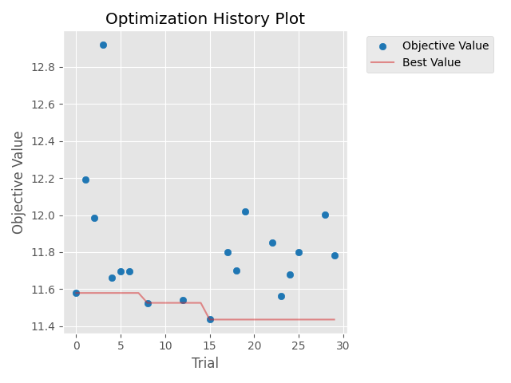
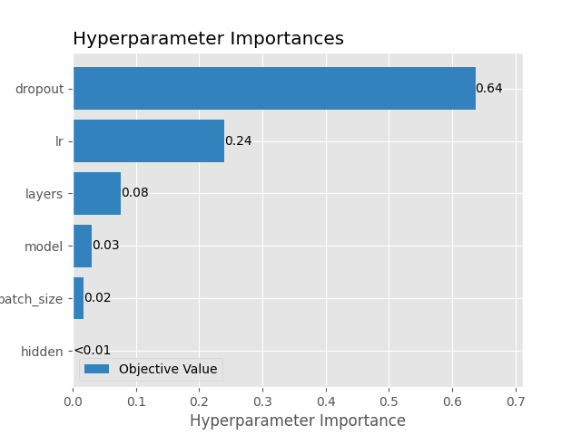

# Predictive Maintenance — NASA C-MAPSS

Prédiction de la durée de vie restante (RUL) de turboréacteurs et détection d'anomalies,
avec un pipeline ML et MLOps complet.

## Installation
poetry install

## Structure
- data/ : données brutes et prétraitées
- notebooks/ : exploration
- src/ : code source
- tests/ : tests
- configs/ : configuration

## Résultats sur FD001

| Modèle | Val RMSE | Test RMSE | Test MAE | Score NASA |
|---|---|---|---|---|
| Régression linéaire | 15,06 | 15,71 | 12,73 | 441,7 |
| Random Forest | 12,96 | 13,14 | 9,20 | 302,5 |
| **LightGBM** | 12,63 | **13,13** | **9,76** | **278,1** |
| GRU | **11,77** | 13,75 | 10,01 | 336,7 |
| LSTM | 12,10 | 14,29 | 10,49 | 385,0 |
| Transformer | 12,10 | 14,63 | 10,70 | 415,0 |
| CNN 1D | 13,88 | 15,84 | 11,74 | 507,7 |

## Optimisation des hyperparamètres (Optuna)

30 essais avec l'échantillonneur TPE et un pruning par la médiane, suivis sur un serveur MLflow distant (DagsHub). L'objectif est le RMSE de validation ; le test n'est utilisé qu'une fois, sur le meilleur modèle.

### Meilleur modèle

| Hyperparamètre | Valeur |
|---|---|
| Architecture | LSTM |
| Couches | 1 |
| Neurones cachés | 128 |
| Dropout | 0,32 |
| Learning rate | 0,0024 |
| Batch size | 128 |

| Métrique | Valeur |
|---|---|
| Val RMSE | 11,43 |
| Test RMSE | 13,50 |
| Essais arrêtés par le pruning | 11 / 30 |

### Analyse

- Le meilleur RMSE de validation passe de 11,58 (trial 0) à 11,43 (trial 15), puis stagne : des essais supplémentaires apporteraient peu. La marge de progression se situe désormais du côté des données (taille de fenêtre, features).
- Le pruning a arrêté 11 essais après quelques epochs, ce qui a nettement réduit le temps de calcul.

- Le dropout (64 %) et le learning rate (24 %) dominent : la régularisation est le facteur clé sur ce petit jeu de données.
- Le choix LSTM / GRU (3 %), la taille du batch et le nombre de neurones cachés ont peu d'effet : un modèle compact suffit, ce qui facilite le déploiement.

### Écart entre validation et test

- La validation contient toutes les fenêtres de chaque moteur, y compris les fins de vie, faciles à prédire ; le test ne contient que la dernière fenêtre observée de chaque moteur, souvent avant une dégradation nette.
- Les hyperparamètres ont été choisis sur la validation, dont le score est donc légèrement optimiste (biais de sélection). Le test reste l'estimation fiable de la performance.

### Model Registry

Le meilleur modèle est emballé au format MLflow pyfunc (poids, paramètres, code et dénormalisation de la sortie) et enregistré sous le nom `rul-predictor`, avec l'alias `champion`. Le modèle rechargé depuis le registry reproduit exactement le RMSE de test (13,50).